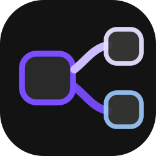
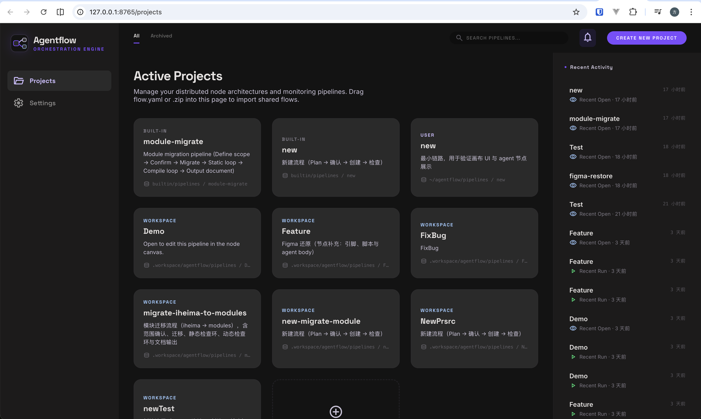
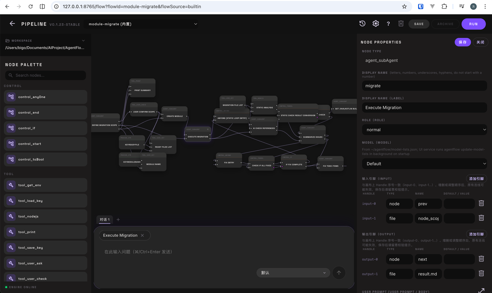
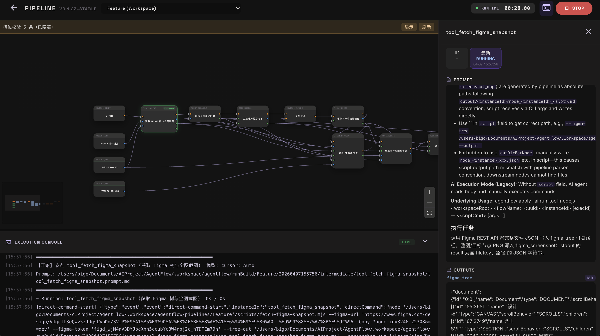

<p align="center">
  
</p>

<h1 align="center">AgentFlow</h1>

<p align="center">Let your AI agents work 12 hours straight — then quietly blow everyone away</p>

<p align="center">
  <a href="./LICENSE"></a>
</p>

<p align="center">
  <a href="./README.zh-CN.md">中文</a> | <b>English</b>
</p>

>
> Wire up Cursor / OpenCode / Claude Code as execution backends — run, pause, resume.







## The Problem

Coding agents like Cursor and Claude Code are great — until the task gets long.

**1. Context window is a hard ceiling.**
A 10-minute task fits comfortably. A 10-hour migration? The model starts forgetting earlier steps, repeating work, or silently drifting off course. Context compression helps, but it's lossy — the agent no longer has the full picture.

**2. Process reliability degrades with length.**
You tell the agent: "after step 1, ask me to confirm; after step 2, run tests." It works the first few times. Three hours in, the confirmation step gets compressed away and the agent just... skips it. This is the same class of problem that caused [an AI to delete a user's emails](https://www.reddit.com/r/ChatGPTPro/comments/1kcra9d/) — not malice, just lost context.

**3. Markdown checklists aren't control flow.**
You can write a numbered plan in a prompt, but you can't express "loop until compilation passes" or "if tests fail, go back to step 3." Real workflows need real branches and loops — not a flat list that the model interprets however it wants.

**AgentFlow fixes this by moving orchestration out of the context window.** Workflows are defined as node graphs with explicit edges, loops, and conditionals. Each node runs in a fresh agent session with only its own inputs — no context to degrade. State is persisted to disk between nodes, so a 10-hour workflow is just a sequence of focused 10-minute tasks.

## Features

- **Reuse existing agents** — Cursor, OpenCode, Claude Code as swappable backends; no platform migration
- **Visual editor + AI Composer** — drag-and-drop nodes or describe workflows in natural language
- **Persistent state** — every node's I/O cached to disk (like Gradle task caching); resume from any failure point
- **Loop / branch / parallel** — `control_if`, `control_anyOne`, `control_toBool` for real control flow
- **CI/CD ready** — deterministic graphs, long-running, `--machine-readable` JSON event stream

## Quick Start

**Requirements:** Node >= 18, one of: Cursor CLI (`agent`), OpenCode CLI, or Claude Code

```bash
# Install
npm install -g agentflow

# Launch Web UI (port 8765)
agentflow ui

# Or run a flow directly
agentflow apply <FlowName>
```

From source: `git clone` → `npm install` → `npm link`.

## Creating Flows

### Option A: Visual Editor

In the Web UI — create pipeline → drag nodes from palette → connect edges → save.

### Option B: AI Composer (recommended)

Open the right-side Composer panel and describe what you need:

```
Create a code review flow:
1. Scan the codebase for issues
2. Auto-fix issues
3. Re-check
4. Loop until all pass
```

Composer auto-detects loop patterns and generates the correct control-flow nodes. Complex flows are built in three phases: topology → node details → wiring & validation (auto-repairs up to 5 times).

## Running & Recovery

```bash
# Execute
agentflow apply <FlowName>

# Check status
agentflow run-status <FlowName> <uuid>

# Resume from failure
agentflow resume <FlowName> <uuid>

# Retry one node
agentflow replay <FlowName> <uuid> <instanceId>

# View agent reasoning
agentflow extract-thinking <FlowName> <uuid>
```

## Tutorials

- [Quickstart: PR Workflow Automation](docs/wiki/quickstart-pr-workflow.en.md)
- [Module Migration Workflow](docs/wiki/module-migration-workflow.en.md)
- [Figma UI Implementation Workflow](docs/wiki/figma-ui-implementation-workflow.en.md)

## CLI Reference

| Command | Description |
|---------|-------------|
| `list` | List all pipelines |
| `ui` | Start Web UI |
| `apply` | Execute flow |
| `validate` | Validate flow structure |
| `resume` | Resume from breakpoint |
| `replay` | Retry a single node |
| `run-status` | View execution status |
| `extract-thinking` | Extract agent thinking process |

### Options

| Flag | Description |
|------|-------------|
| `--workspace-root <path>` | Workspace root directory |
| `--dry-run` | Preview ready nodes without execution |
| `--model <name>` | Override model |
| `--parallel` | Parallel execution for independent nodes |
| `--machine-readable` | JSON event stream (for UI/CI integration) |
| `--lang <code>` | Language (`zh` / `en`) |

### Environment Variables

| Variable | Default | Description |
|----------|---------|-------------|
| `CURSOR_AGENT_CMD` | `agent` | Cursor CLI command |
| `CURSOR_AGENT_MODEL` | — | Default model |
| `AGENTFLOW_HOME` | `~/agentflow` | User data directory |

## Directory Layout

```
~/agentflow/                          # User data (pipelines, agents, config)
<workspace>/.workspace/agentflow/
  ├── pipelines/<flowId>/             # Project-local pipeline copies
  ├── nodes/                          # Custom node definitions
  └── runBuild/<flowId>/<uuid>/       # Run artifacts & per-node status
```

## i18n

- CLI: `--lang` flag or `LANG` env
- Web UI: auto-detects browser language
- Agent prompts: `agents/<lang>/` directory

Supported: `zh` (中文), `en` (English)

## Contributing

See [CONTRIBUTING.md](CONTRIBUTING.md).

## License

[MIT](LICENSE)
