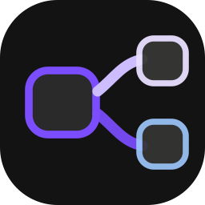
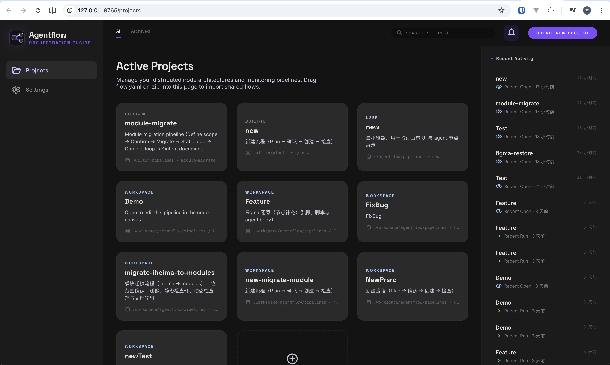
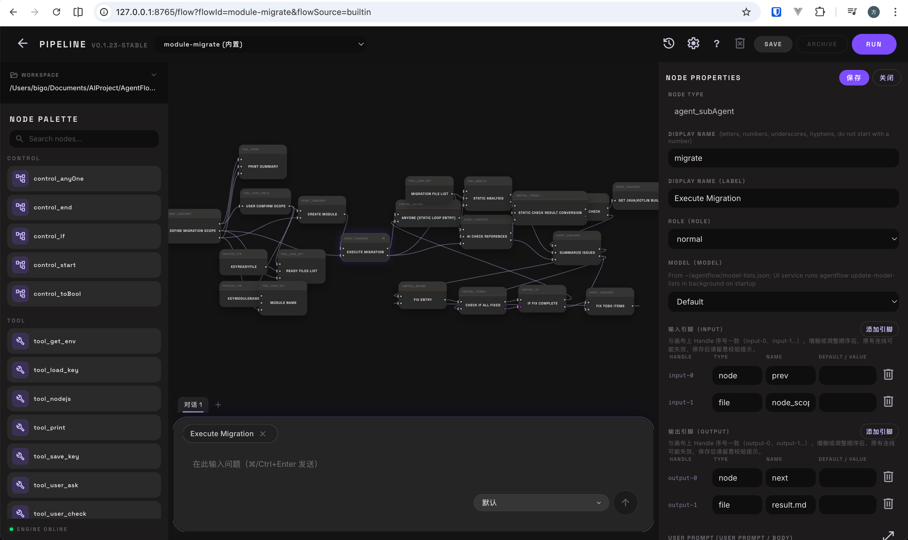
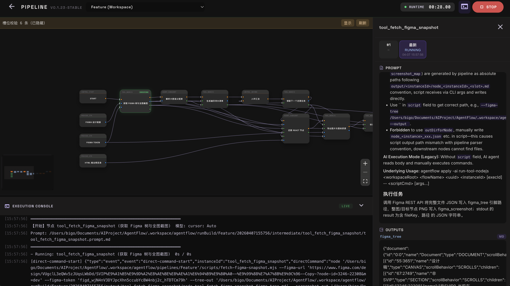

<p align="center">
  
</p>

<h1 align="center">AgentFlow</h1>

<p align="center">Let your AI agents work 12 hours straight — then quietly blow everyone away</p>

<p align="center">
  <a href="./LICENSE"></a>
  <a href="https://agentflow-hub.com"></a>
</p>

<p align="center">
  <a href="./README.zh-CN.md">中文</a> | <b>English</b>
</p>

>
> Orchestrate complex, long-running tasks — module migrations, AI automation, deep code cleanup — using Cursor / OpenCode / Claude Code / Codex as swappable backends.







### Terminology

In this repository, an executable node graph is called a **Flow** (also
shown as a Pipeline in the editor) and is stored in `flow.yaml`. A product
requirement **Workflow** is a separate TAPD-backed record addressed as
`tapd:<id>`; it is not created, archived, or updated by the Flow editor.

## The Problem

Coding agents like Cursor, Claude Code, and Codex are great — until the task gets long.

**1. Context window is a hard ceiling.**
A 10-minute task fits comfortably. A 10-hour migration? The model starts forgetting earlier steps, repeating work, or silently drifting off course. Context compression helps, but it's lossy — the agent no longer has the full picture.

**2. Process reliability degrades with length.**
You tell the agent: "after step 1, ask me to confirm; after step 2, run tests." It works the first few times. Three hours in, the confirmation step gets compressed away and the agent just... skips it. This is the same class of problem that caused [an AI to delete a user's emails](https://www.reddit.com/r/ChatGPTPro/comments/1kcra9d/) — not malice, just lost context.

**3. Markdown checklists aren't control flow.**
You can write a numbered plan in a prompt, but you can't express "loop until compilation passes" or "if tests fail, go back to step 3." Real workflows need real branches and loops — not a flat list that the model interprets however it wants.

**AgentFlow fixes this by moving orchestration out of the context window.** Workflows are defined as node graphs with explicit edges, loops, and conditionals. Each node runs in a fresh agent session with only its own inputs — no context to degrade. State is persisted to disk between nodes, so a 10-hour workflow is just a sequence of focused 10-minute tasks.

## Features

- **Reuse your AI subscriptions** — Cursor Pro, OpenCode (Alibaba Cloud, etc.), Claude Code, Codex; no need to purchase LLM API keys
- **Visual editor + AI Composer** — drag-and-drop nodes or describe workflows in natural language
- **Persistent state** — every node's I/O cached to disk (like Gradle task caching); resume from any failure point
- **Loop / branch / parallel** — `control_if`, `control_anyOne`, `control_toBool` for real control flow
- **CI/CD ready** — deterministic graphs, long-running, `--machine-readable` JSON event stream

## Quick Start

**Requirements:** Node >= 18, one of: Cursor CLI (`agent`), OpenCode CLI, Claude Code, or Codex CLI

```bash
# Install
npm install -g @fieldwangai/agentflow

# Launch Web UI (port 8765)
agentflow ui

# Upload a Workspace graph to a server-side temporary preview project
node skills/agentflow-cli/scripts/agentflow-cli.mjs workspace-preview \
  --file .workspace/agentflow/pipelines/my-flow/workspace.graph.json \
  --ttl-seconds 7200

```

Runs are started from the Workspace graph in the Web UI, or on a schedule via a
`workspace_scheduled_run` node.

From source: `git clone` → `npm install` → `npm link`.

## Creating Flows

### Option A: Visual Editor

In the Web UI — create pipeline → drag nodes from palette → connect edges → save.

### Option B: AI Composer (recommended)

Open the right-side Composer panel and describe what you need:

```
Create a code review flow:
1. Scan the codebase for issues
2. Auto-fix issues
3. Re-check
4. Loop until all pass
```

Complex flows are built in three phases: topology → node details → wiring & validation (auto-repairs up to 5 times). Note the Workspace runtime executes a DAG — cyclic graphs are rejected, so describe check-then-fix work as forward steps rather than a loop.

## Running

Runs start from the Workspace graph: open the flow in the Web UI and hit **Run**, or add a
`workspace_scheduled_run` node for cron-driven runs. Every node's inputs, outputs and state
are persisted under the flow's run directory.

The legacy Start/End Pipeline runtime is retired — `agentflow apply` / `resume` / `replay`
and the `/api/flow/run*` endpoints no longer execute anything.

```bash
# Check node status of a run
agentflow run-status <FlowName> <uuid>

# View agent reasoning
agentflow extract-thinking <FlowName> <uuid>

# Validate a flow definition
agentflow validate <FlowName>
```

## Skills

AgentFlow provides specialized skills for common operations:

| Skill | Description |
|-------|-------------|
| `agentflow-author-flow` | Generate a Flow from natural language in Codex/Cursor, validate it, open a static preview, and publish it to personal, workspace, or team scope after confirmation |
| `agentflow-cli` | Query, publish, and run platform Flows directly with a token and no MCP |
| `agentflow-flow-add-instances` | Add new nodes to flow.yaml with proper YAML structure, connection design, and positioning |
| `agentflow-flow-edit-node-fields` | Edit allowed fields in existing nodes (label, body, role, input/output values) without breaking topology |
| `agentflow-flow-sync-ui` | Sync flow.yaml changes to Web UI canvas after saving to disk |
| `nestjs-route-order-debug` | Debug NestJS route conflicts between parameter routes (`:id`) and concrete routes |

Skills are automatically loaded when relevant tasks are detected, providing domain-specific instructions and workflows.

For example, tell Codex/Cursor: “Use `agentflow-author-flow` to generate a Flow that sends a WeCom notification after a Jenkins build, open the local preview first, and publish it to my team after I confirm.” The agent handles the local files, validation, preview, and publish command; the user only confirms the result.

## Tutorials

- [Quickstart: PR Workflow Automation](docs/wiki/quickstart-pr-workflow.en.md)
- [Module Migration Workflow](docs/wiki/module-migration-workflow.en.md)
- [Figma UI Implementation Workflow](docs/wiki/figma-ui-implementation-workflow.en.md)

## CLI Reference

| Command | Description |
|---------|-------------|
| `list` | List all pipelines |
| `ui` | Start Web UI |
| `apply` | Execute flow |
| `validate` | Validate flow structure |
| `resume` | Resume from breakpoint |
| `replay` | Retry a single node |
| `run-status` | View execution status |
| `extract-thinking` | Extract agent thinking process |

### Options

| Flag | Description |
|------|-------------|
| `--workspace-root <path>` | Workspace root directory |
| `--dry-run` | Preview ready nodes without execution |
| `--model <name>` | Override model. Use prefixes such as `opencode:<model>`, `claude-code:<model>`, `codex:<model>`, or `api:<provider>/<model>` to switch backends |
| `--parallel` | Parallel execution for independent nodes |
| `--machine-readable` | JSON event stream (for UI/CI integration) |
| `--lang <code>` | Language (`zh` / `en`) |

### Environment Variables

| Variable | Default | Description |
|----------|---------|-------------|
| `CURSOR_AGENT_CMD` | `agent` | Cursor CLI command |
| `CURSOR_AGENT_MODEL` | — | Default model |
| `OPENCODE_CMD` | `opencode` | OpenCode CLI command |
| `CLAUDE_CODE_CMD` | `claude` | Claude Code CLI command |
| `AGENTFLOW_CLAUDE_CODE_BYPASS_PERMISSIONS` | `1` | Pass `--dangerously-skip-permissions` to Claude Code; set `0` for interactive approval |
| `AGENTFLOW_CLAUDE_CODE_STDERR_INHERIT` | `0` | Forward Claude Code stderr directly to terminal for debugging |
| `CODEX_CMD` | `codex` | Codex CLI command |
| `CODEX_MODEL` | — | Default Codex model when no explicit `codex:<model>` is set |
| `AGENTFLOW_CODEX_SANDBOX` | `workspace-write` | Codex sandbox mode passed to `codex exec` |
| `AGENTFLOW_CODEX_APPROVAL` | `never` | Codex approval policy passed before `exec` |
| `AGENTFLOW_CODEX_DANGER` | `0` | Set `1` to pass `--dangerously-bypass-approvals-and-sandbox` to Codex |
| `AGENTFLOW_CODEX_SKIP_GIT_CHECK` | `auto` | Skip Codex git-repo check automatically when the execution directory has no `.git` ancestor; set `1`/`0` to force |
| `AGENTFLOW_CODEX_IGNORE_USER_CONFIG` | `1` | Run Codex with `--ignore-user-config` so AgentFlow jobs only use the MCP/config overrides AgentFlow passes in; set `0` to also load the user's Codex config |
| `AGENTFLOW_CODEX_STDERR_INHERIT` | `0` | Forward Codex stderr directly to terminal for debugging |
| `AGENTFLOW_HOME` | `~/agentflow` | User data directory |
| `AGENTFLOW_CAS_ENABLED` | `0` | Enable CAS for regular Web UI users; admins continue to use `/admin/login` |
| `AGENTFLOW_CAS_BASE_URL` | `https://auth.bigo.sg/cas/` | CAS server root URL |
| `AGENTFLOW_CAS_SERVICE_URL` | derived from `AGENTFLOW_PUBLIC_BASE_URL` | Exact CAS callback service URL, normally `https://host/api/auth/cas/callback` |
| `AGENTFLOW_LEGACY_PASSWORD_LOGIN` | `0` when CAS is enabled | Temporarily keep the legacy regular-user password API during migration |
| `AGENTFLOW_PUBLIC_BASE_URL` | request origin | Public Web UI origin used to construct CAS callbacks behind a reverse proxy |

When CAS is enabled, regular users are provisioned on their first successful CAS login and use the authorization scope from the CAS application, bypassing AgentFlow's local user allowlist. Under **Settings → Sync legacy account**, a CAS user can prove ownership with the old password and self-migrate Projects, collaboration ownership, and schedules; the old account is then disabled without rewriting historical run audit records. The administrator keeps a local password and signs in through `/admin/login`, and can still reassign individual Projects under **Admin → Users & Ownership**.

### Codex Backend

Use `--model codex:<model>` or select a Codex model in the Web UI to run Composer or agent nodes through `codex exec`. Run `codex login` first, then refresh model lists with `agentflow update-model-lists` so the UI can show Codex models.

Composer reuses the MCP servers managed in AgentFlow's MCP page by translating Cursor MCP config into Codex `-c mcp_servers...` overrides for the current process. Stdio MCP private env values are passed through the Codex child process environment; HTTP `Authorization: Bearer ...` headers are converted to `bearer_token_env_var`.

The MCP page shows a backend compatibility matrix for each server. Codex is marked partial when a server relies on features Codex cannot express exactly, such as arbitrary HTTP headers or URL-level env values.

## Directory Layout

```
~/agentflow/                          # User data (pipelines, agents, config)
<workspace>/.workspace/agentflow/
  ├── pipelines/<flowId>/             # Project-local pipeline copies
  ├── nodes/                          # Custom node definitions
  └── runBuild/<flowId>/<uuid>/       # Run artifacts & per-node status
```

## i18n

- CLI: `--lang` flag or `LANG` env
- Web UI: auto-detects browser language
- Agent prompts: `agents/<lang>/` directory

Supported: `zh` (中文), `en` (English)

## Contributing

See [CONTRIBUTING.en.md](CONTRIBUTING.en.md).

## License

[MIT](LICENSE)
